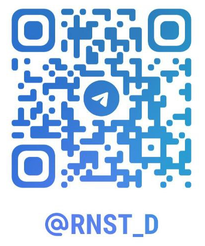

# Начинаем работу с QR-Passport
Данная инструкция содержит всю необходимую информацию для освоения системы и эффективной работы с QR-Passport.

<!--

Интерфейс системы будет выглядеть по-разному в зависимости от прав доступа (_подробнее о правах доступа см. [пользователи](company/users.md#anchor)_).

-->

## Порядок изучения

1. Раздел [Быстрый старт](quick_start.md) знакомит с основными принципами работы на практическом примере.

2. Последующие разделы содержат детальное описание функционала для углубленного изучения.

<!--## Вход в систему

1. Перейдите по [ссылке](https://qrpassport.app/admin). 

2. Для входа в систему используйте учетные данные, направленные администратором QR-Passport после обработки заявки на сайте.

-->

## Техническая поддержка

Если возникнут трудности, напишите нашим специалистам в Telegram:

|  Розалия  |  Эрнест  |
|:---------:|:--------:|
|||

