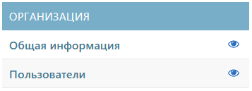
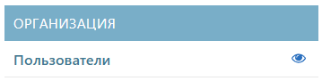

# О разделе
Раздел «Организация» предназначен для настройки основной информации о компании и её структуре в системе QR-Passport. 
Он включает несколько подразделов:
1. [Общая информация](#anchor)
2. [Пользователи](users.md#anchor)
3. [Департаменты](department.md#anchor)
4. [Должности](positions.md#anchor)



Раздел «Организация» будет выглядеть по-разному в зависимости от прав доступа.



*Рисунок 1 – Отображение раздела для сотрудника с доступом «company_administrator»*

*Рисунок 2 – Отображение раздела для сотрудника с доступом «engineers»*

*Рисунок 3 – Отображение раздела для сотрудника с доступом «service» или «warehouse»*

**Активные кнопки**
- Добавить элемент
- Переход к подразделу
-  Просмотр подраздела



- Отображение раздела для сотрудника с доступом «company_administrator»

  

- Отображение раздела для сотрудника с доступом «engineers»

  
 
- Отображение раздела для сотрудника с доступом «service» или «warehouse»

  



{name=cutgroup}



{name=cutgroup}



{#cut-3 name=cutgroup}

