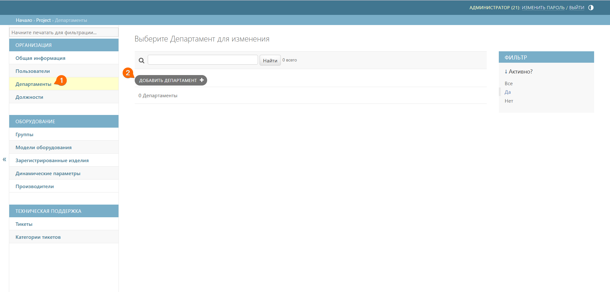
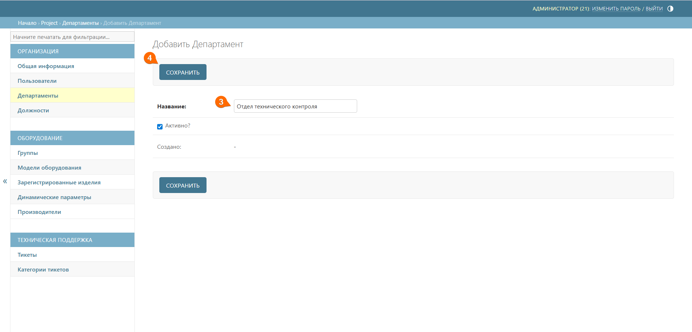

# Департаменты
Здесь вы можете добавить отделы, подразделения или департаменты вашей компании (например, «Склад», «ОТК» и т.д.), к которым относятся пользователи системы QR-Passport.

## Создание департамента
Для создания нового департамента выполните следующие шаги:
1. Перейдите к подразделу **Департаменты**
2. Нажмите кнопку **Добавить департамент**





3. Добавьте название отдела, подразделения или департамента
4. Нажмите кнопку **Сохранить**



