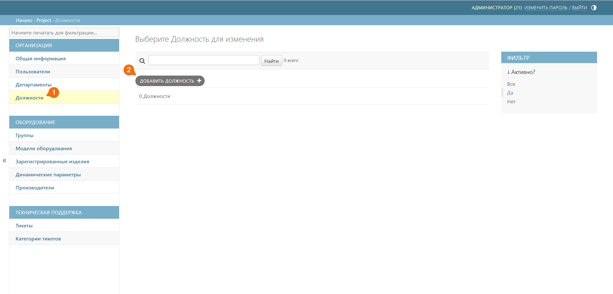
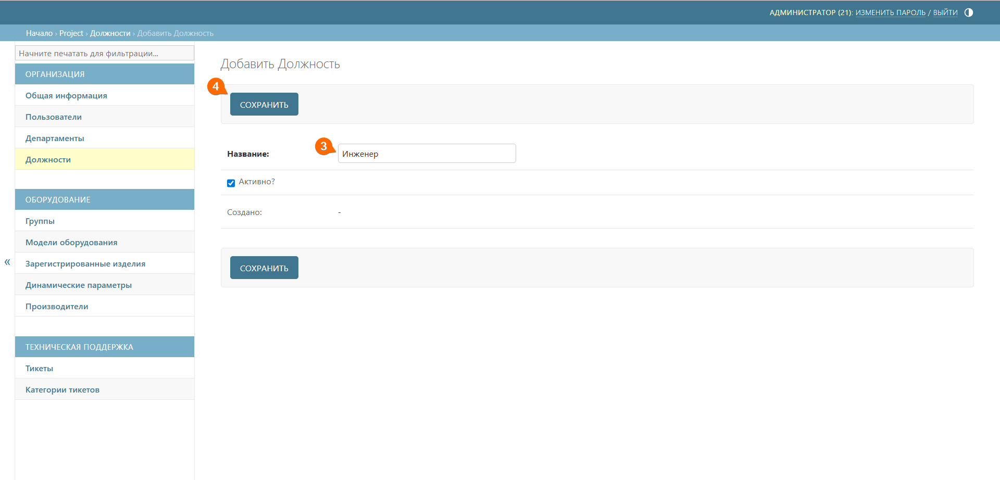

# Должности
Здесь вы можете создать список должностей для сотрудников вашей компании, которые являются пользователями системы QR-Passport (например, «Инженер», «Сотрудник склада» и т.д.).

## Создание должности
Для создания новой должности выполните следующие шаги:
1. Перейдите к подразделу **Должности**
2. Нажмите кнопку **Добавить должность**





3. Добавьте название должности
4. Нажмите кнопку **Сохранить**



