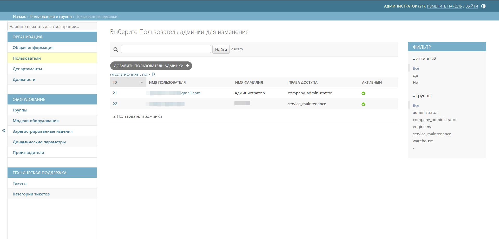
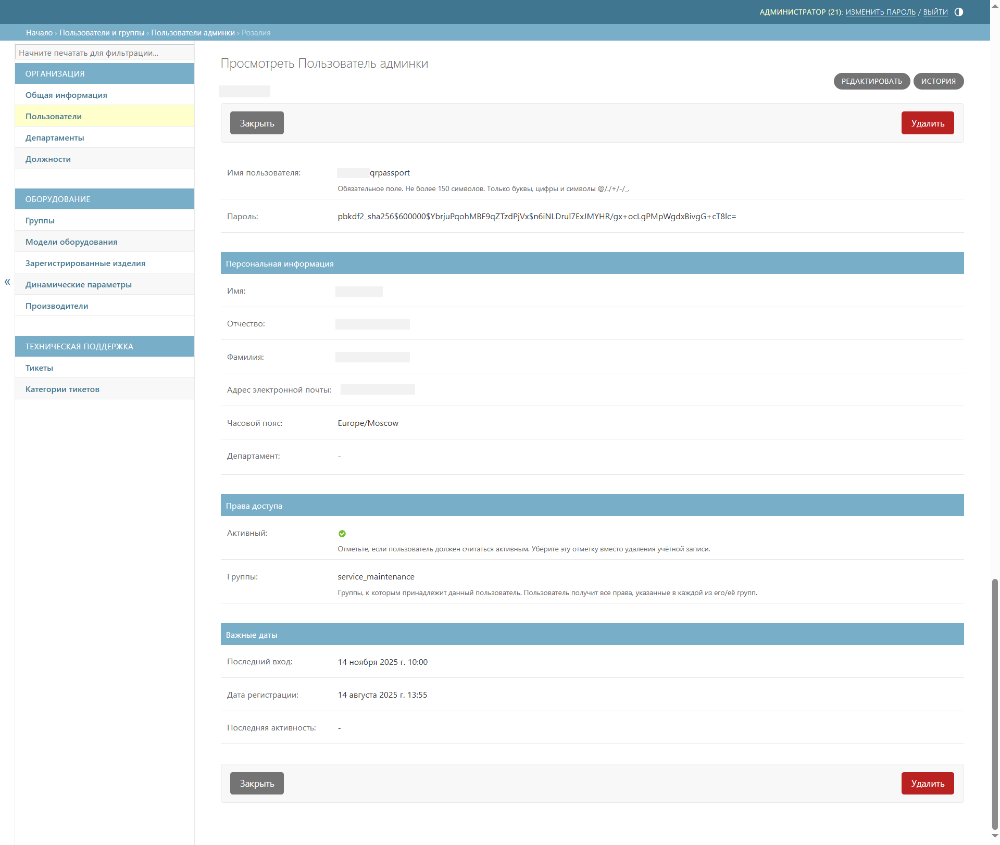
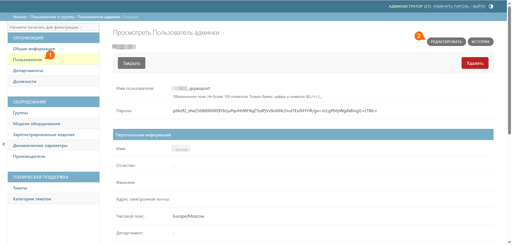
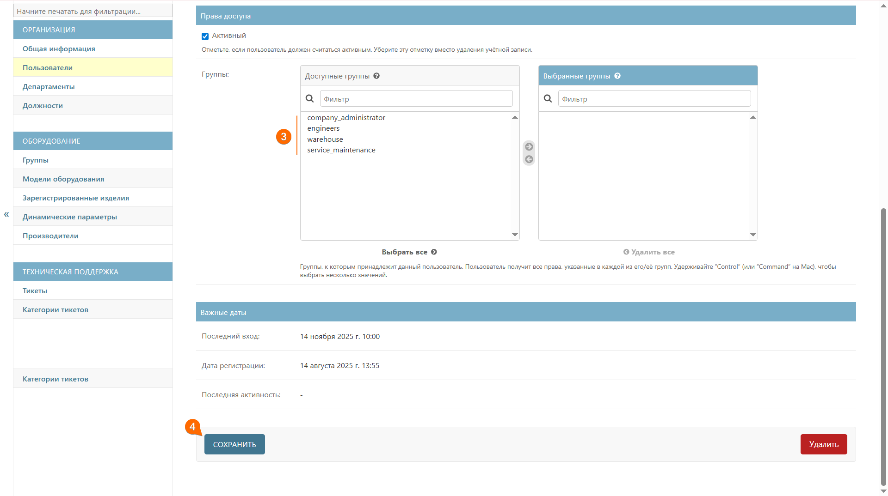

# Пользователи
Подраздел **Пользователи** предназначен для создания, просмотра и редактирования данных о пользователях системы QR-Passport.



Подраздел **Пользователи** доступен для редактирования сотрудникам с правами _company administrator_.



## Описание главного окна

Таблица пользователей содержит следующие колонки:
* _ID_ – уникальный идентификатор пользователя в системе;
* _имя пользователя_ – логин для входа в QR-Passport (выше по наименованию этой колонки осуществляется поиск пользователей); 
* _имя фамилия_ – имя и фамилия пользователя (выше по наименованию этой колонки осуществляется поиск пользователей по имени);
* _права доступа_ – уровень доступа к функционалу QR-Passport (справа доступна фильтрация по правам доступа);
* _активный_ – статус активности учётной записи (справа доступна фильтрация по статусу активности).



Для удобства работы сначала создайте [департаменты](department.md#anchor) и [должности](positions.md#anchor), а затем добавляйте пользователей. 



### Просмотр детальной информации

Для просмотра полной информации о пользователе необходимо выбрать соответствующую запись из общего списка.

При нажатии на имя пользователя осуществляется переход в карточку пользователя, где доступны следующие блоки информации:

* _учетные данные_ – имя пользователя и пароль (отображается в зашифрованном виде с использованием надежного алгоритма хеширования);



 Пароль хранится в зашифрованном виде, доступ к исходному паролю имеет только сам пользователь.



* _персональная информация_ – ФИО, должность, департамент, email и часовой пояс, который настраивается индивидуально для каждого сотрудника;
* _права доступа_ – настройка прав доступа и отметка о статусе активности учётной записи (снятие отметки _Активный_ является альтернативой удалению учётной записи);
* _важные даты_ – позволяет отслеживать активность использования системы.

### Описание прав доступа



- company administrator

    Сотрудник имеет полный доступ к разделам:

    * [организация](about_company.md#anchor);

    * [оборудование](../equipment/about_equipment.md#anchor);

    * [техническая поддержка](../support/about_support.md#anchor).

- engineers

    Сотрудники имеют доступ к подразделам:

    * [общая информация](company.md#anchor) – просмотр информации о компании;  
   
    * [пользователи](users.md#anchor) – просмотр информации о пользователях;  

    * [группы](../equipment/equipment.md#anchor) – создание и редактирование групп;  

    * [модели оборудования](../equipment/models.md#anchor) – создание и редактирование моделей, регистрация изделия, массовая регистрация изделий, удаление изделия/изделий, скачивание QR-кода/QR-кодов, скачивание паспорта/паспортов, архивирование изделий;  

    * [зарегистрированные изделия](../equipment/registered_products.md#anchor) – удаление изделия/изделий, скачивание QR-кода/QR-кодов, скачивание паспорта/паспортов; 

    * [динамические параметры](../equipment/dynamic_parameters.md#anchor) – создание и редактирование динамических параметров;  

    * [производители](../equipment/manufacturers.md#anchor) – создание и редактирование наименований компаний-производителей. 

- service maintenance

    Сотрудники имеют доступ к подразделам:

    * [пользователи](users.md#anchor) – просмотр информации о пользователях;  
     
    * [группы](../equipment/equipment.md#anchor) – просмотр групп;   
     
    * [модели оборудования](../equipment/models.md#anchor) – просмотр моделей, просмотр документов, регистрация изделия, массовая регистрация изделий, скачивание QR-кода/QR-кодов, скачивание паспорта/паспортов, архивирование изделий;  
    
    * [зарегистрированные изделия](../equipment/registered_products.md#anchor) – скачивание QR-кода/QR-кодов, скачивание паспорта/паспортов;  
    
    * [динамические параметры](../equipment/dynamic_parameters.md#anchor) – просмотр динамических параметров; 

    * [тикеты](../support/support.md#anchor) – работа с тикетом, ведение переписки с клиентами;

    * [категории тикетов](../support/ticket_categories.md#anchor) – создание категории тикетов.

- warehouse

    Сотрудники имеют доступ к подразделам:

    * [пользователи](users.md#anchor) – просмотр информации о пользователях;  
    
    * [группы](../equipment/equipment.md#anchor) – просмотр групп;  
    
    * [модели оборудования](../equipment/models.md#anchor) – просмотр моделей, просмотр документов, регистрация изделия, массовая регистрация изделий, скачивание QR-кода/QR-кодов, скачивание паспорта/паспортов, архивирование изделий;  
    
    * [зарегистрированные изделия](../equipment/registered_products.md#anchor) – скачивание QR-кода/QR-кодов, скачивание паспорта/паспортов;  
    
    * [динамические параметры](../equipment/dynamic_parameters.md#anchor) – просмотр динамических параметров.


 
### Настройка прав доступа



* **company administrator** (администратор) – права доступа могут быть назначены только одному сотруднику в компании.
* **engineers** (инженер) – права доступа могут быть назначены нескольким сотрудникам в компании.
* **service maintenance** (сервисное обслуживание) – права доступа могут быть назначены нескольким сотрудникам в компании.
* **warehouse** (склад) – права доступа могут быть назначены нескольким сотрудникам в компании.



Для настройки прав доступа для пользователя выполните следующие шаги:
1. Перейдите к подразделу **Пользователи**
2. Нажмите кнопку **Редактировать**





3. В блоке **Права доступа** двойным щелчком мыши или перетаскиванием выберите доступ этого пользователя к функционалу QR-Passport
4. Нажмите кнопку **Сохранить**







 Не рекомендуется редактировать права у пользователя с доступом _company administrator_.

