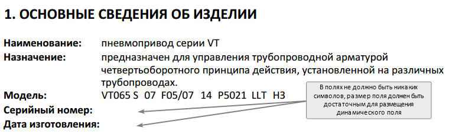
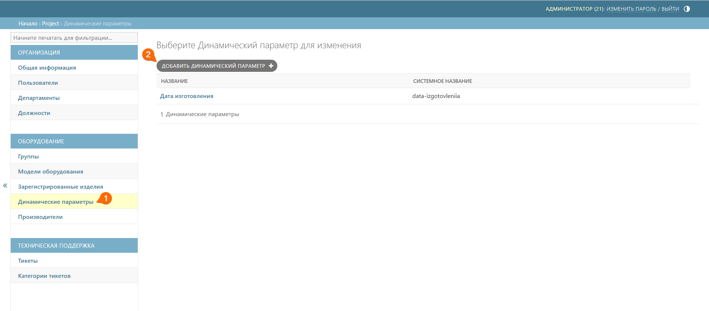

# Динамические параметры
Подраздел **Динамические параметры** предназначен для создания общих динамических параметров для индивидуальных паспортов, таких как заводской номер, дата изготовления и других.

## Шаблон паспорта
Динамические параметры в сам шаблон паспорта вбивать не нужно. За вас это сделает QR‑Passport на этапе регистрации изделия. Для этого в шаблоне паспорта необходимо оставить пустое место для внесения этих параметров сервисом QR‑Passport, иначе вставленные параметры перекроют имеющийся текст.



Динамические параметры задаются на этапе [создания модели](./models.md#anchor), а заполнять данные параметры нужно на этапе [регистрации изделий](./registered_products.md#anchor).



## Создание динамического параметра
Для создания нового динамического параметра выполните следующие шаги:
1. Перейдите к подразделу **Динамические параметры**
2. Нажмите кнопку **Добавить динамический параметр** 





3. Добавьте название динамического параметра



Наименование динамического параметра должно соответствовать следующим правилам:
- **Допустимые символы:** буквы, цифры, пробел и запятая. Например: «**Серийный номер**», «**Серийный, заводской номер**»**.
- **Недопустимые символы:** точки, знак №, нижнее подчеркивание и другие специальные символы. Например: «**Серийный №**», «**Серийный_номер**», «**Зав. номер**».

_Использование недопустимых символов в наименовании приведет к некорректной обработке динамического параметра системой._



4. Нажмите кнопку **Сохранить**







Не рекомендуется редактировать наименование имеющегося динамического параметра, поскольку это может привести к некорректной работе текущих шаблонов паспортов в системе.



<!--##  Пример

_Нужно создать 5 однотипных паспортов с такими параметрами:_

- **Дата изготовления**:

    * 02.02.2025

- **Серийный номер**:
    * 001-АБВ 
    * 002-АБВ
    * 003-АБВ
    * 004-АБВ
    * 005-АБВ

_И 5 однотипных паспортов с другими параметрами:_

- **Дата изготовления**
    * 27.05.2025

- **Серийный номер**: 
    * 006-АБВ
    * 007-АБВ
    * 008-АБВ

Чтобы выполнить эту задачу создаем 1 шаблон паспорта с двумя динамическими параметрами:

- **Дата изготовления**
- **Серийный номер**-->

