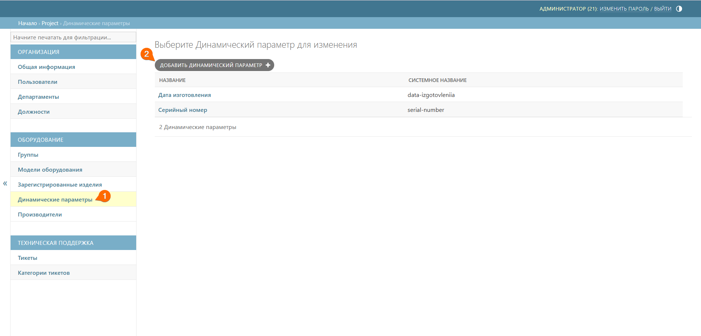
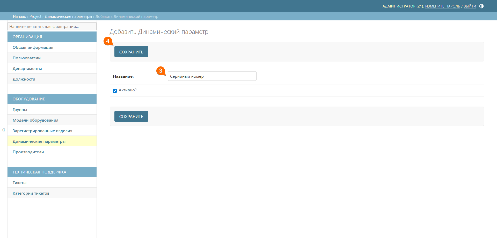

# Динамические параметры
Динамические параметры позволяют создавать индивидуальные паспорта на основе единого шаблона. Это осуществляется путем определения общих динамических параметров, таких как заводской номер, дата изготовления и других.

## Ключевые моменты

Динамические параметры в сам шаблон паспорта вбивать не нужно. За вас это сделает QR‑Passport на этапе регистрации изделия. Для этого в шаблоне паспорта необходимо оставить пустое место для внесения этих параметров сервисом QR‑Passport, иначе вставленные параметры перекроют имеющийся текст.

_Рисунок 1 – Пример шаблона паспорта_



Динамические параметры задаются на этапе [создания модели](./models.md#anchor), а заполнять данные параметры нужно на этапе [регистрации изделий](./registered_products.md#anchor).



## Создание динамического параметра
Чтобы добавить динамический параметр, выполните следующие шаги:
1. Перейдите к подразделу **Динамические параметры**
2. Нажмите кнопку **Добавить динамический параметр** 





3. Добавьте название динамического параметра
4. Нажмите кнопку **Сохранить**







При добавлении динамического параметра, его наименование не должно содержать спецсимволов, кроме запятой.



##  Пример

_Нужно создать 5 однотипных паспортов с такими параметрами:_

- **Дата изготовления**:

    * 02.02.2025

- **Серийный номер**:
    * 001-АБВ 
    * 002-АБВ
    * 003-АБВ
    * 004-АБВ
    * 005-АБВ

_И 5 однотипных паспортов с другими параметрами:_

- **Дата изготовления**
    * 27.05.2025

- **Серийный номер**: 
    * 006-АБВ
    * 007-АБВ
    * 008-АБВ

Чтобы выполнить эту задачу создаем 1 шаблон паспорта с двумя динамическими параметрами:

- **Дата изготовления**
- **Серийный номер**

