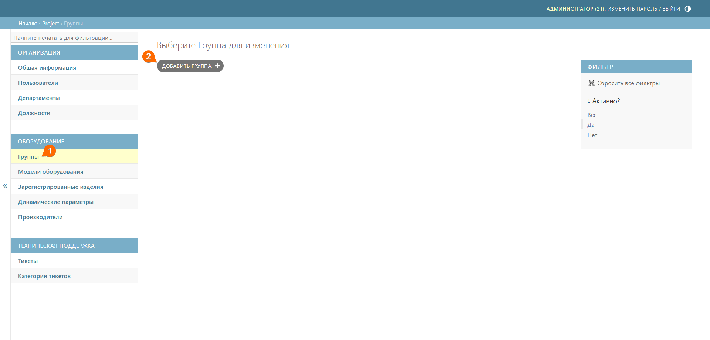
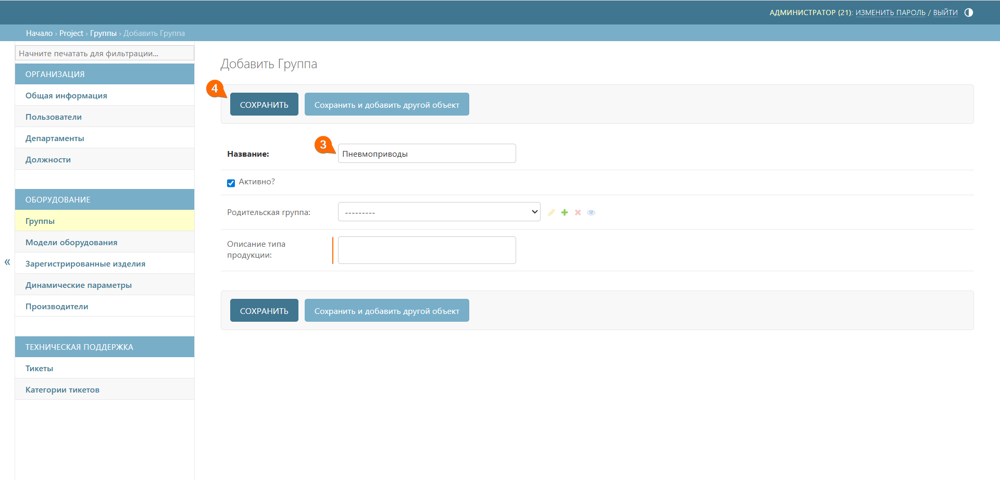
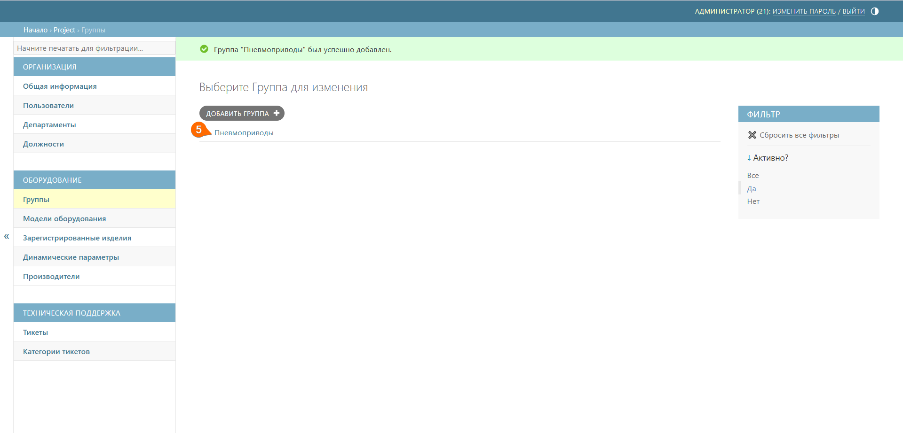
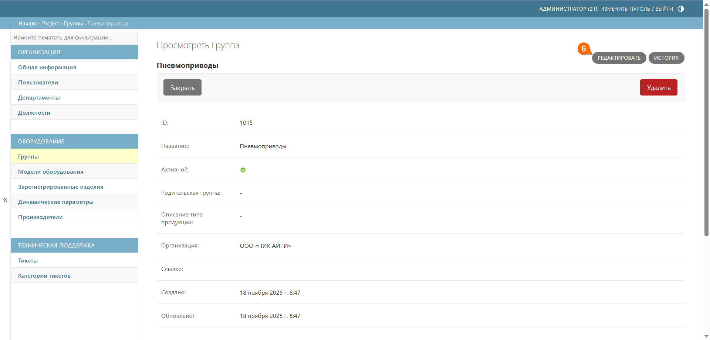

# Группы
Подраздел **Группы** предназначен для построения иерархии оборудования в QR-Passport. 

Функционал позволяет создавать многоуровневую структуру с использованием [родительских](*Родительская_группа) и [дочерних](*Дочерняя_группа) групп для систематизации и упорядочивания оборудования компании.

Иерархия групп обеспечивает удобную навигацию и классификацию оборудования по назначению или технологическим особенностям.

## Создание родительской группы
Для построения иерархии необходимо создать первую родительскую группу в QR-Passport. Эта группа станет основой для структуры оборудования. 

Для этого выполните следующие шаги:
1. Перейдите к подразделу **Группы**
2. Нажмите кнопку **Добавить группу** 





3. Добавьте название родительской группы и описание типа продукции (при необходимости)
4. Нажмите кнопку **Сохранить**







 Поле _Родительская группа_ выбирается только при создании дочерних групп. Для создания первой группы – родительскую группу указывать не нужно.



## Создание дочерней группы

Далее для продолжения построения необходимо создать дочернюю группу в QR-Passport. Для этого выполните следующие шаги:

5. В главном окне **Группы** выберите родительскую группу, в которой необходимо создать дочернюю группу, и кликните по ней. Откроется окно для просмотра данной родительской группы





6. Нажмите кнопку **Редактировать**





7. Нажмите кнопку **Добавить еще одну группу**. Появятся поля для заполнения дочерней группы
8. Добавьте название дочерней группы и описание типа продукции (при необходимости)
9. Нажмите кнопку **Сохранить**







При создании нескольких дочерних групп внутри одной родительской группы повторите шаги 7, 8 необходимое количество раз.



## Структура оборудования

Полученная структура оборудования отображается в виде иерархического списка с раскрывающимися группами. 



Для просмотра вложенных групп необходимо нажать значок «**→**» рядом с названием группы. Свернуть группу можно, нажав значок «**↓**», который появляется после раскрытия.



[*Родительская_группа]: **Родительская группа** – это вышестоящая группа в иерархической структуре, которая содержит в себе подчиненные (дочерние) группы. 

[*Дочерняя_группа]: **Дочерняя группа** – это нижестоящая группа в иерархической структуре, которая входит в состав вышестоящей (родительской) группы.