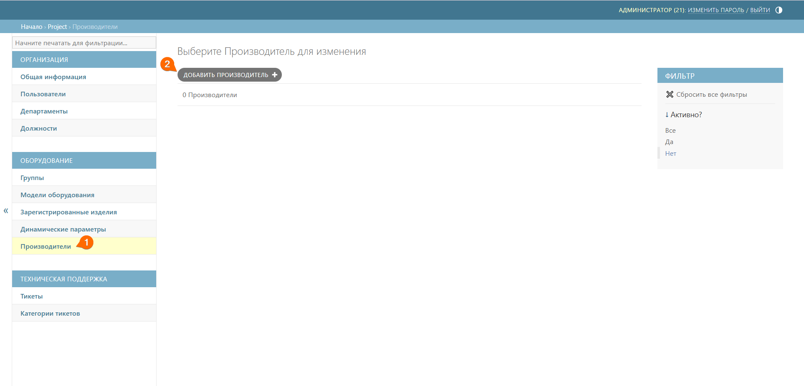
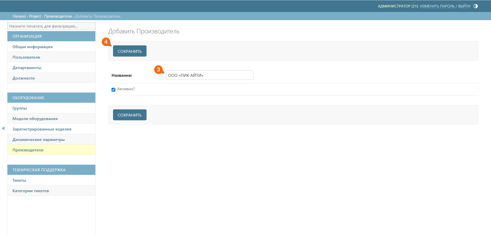

# Производители
Подраздел **Производители** предназначен для управления компаниями-производителями выпускаемых изделий. Позволяет создать и вести базу данных производителей оборудования.

## Создание компании-производителя
Для создания нового производителя выполните следующие шаги:
1. Перейдите к подразделу **Производители**
2. Нажмите кнопку **Добавить производителя**





3. Добавьте название компании-производителя
4. Нажмите кнопку **Сохранить**



