# Модели оборудования
Подраздел **Модели оборудования** предназначен для создания моделей оборудования на основе общих шаблонов паспортов.

## Описание главного окна
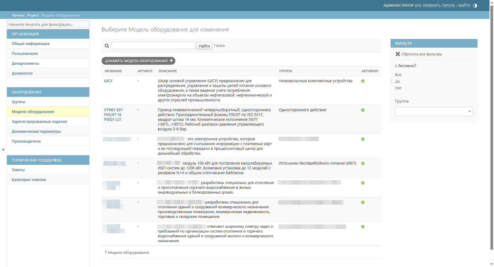

Таблица моделей оборудования содержит следующие колонки:
* _название_ – наименование модели оборудования (выше по наименованию этой колонки осуществляется поиск моделей);
* _артикул_ – артикул, код или другой тип идентификации модели;
* _описание_ – краткое описание модели;
* _группа_ – группа оборудования, к которой относится модель (справа доступна фильтрация по группам);
* _активно_ – статус активности модели (справа доступна фильтрация по статусу активности).

## Описание окна создания модели
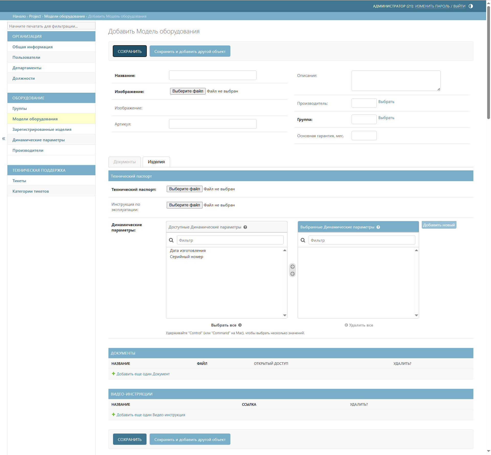
Окно предназначено для создания новой модели оборудования в системе и содержит следующие блоки для заполнения:
* _Название_ – наименование модели оборудования;  
* _Изображение_ – загрузка изображения модели оборудования (формат JPEG/JPG/PNG и т.п.);  
* _Артикул_ – артикул, код или другой тип идентификации модели;  
* _Описание_ – краткое описание модели, которое отображается конечному пользователю при сканировании QR-кода изделия;
* _Производитель_ – выбор компании-производителя из справочника;
* _Группа_ – выбор группы оборудования из иерархической структуры;  
* _Основная гарантия, мес_ – срок гарантии в месяцах. Отсчет начинается со следующего месяца после регистрации изделия;
* _Технический паспорт_ – прикрепление шаблона технического паспорта в формате PDF;  
* _Инструкция по эксплуатации_ – прикрепление инструкции/руководства по эксплуатации в формате PDF;  
* _Динамические параметры_ – выбор динамических параметров. Выбор осуществляется двойным щелчком мыши или перетаскиванием;
* _Документы_ – прикрепление сопроводительных документов к модели (например, сертификаты, декларации и т.д.);
* _Видеоинструкции_ – добавление ссылки на видеоинструкцию.

## Создание модели
Для создания модели выполните следующие шаги:
1. Перейдите к подразделу **Модели оборудования**
2. Нажмите кнопку **Добавить модель оборудования** 



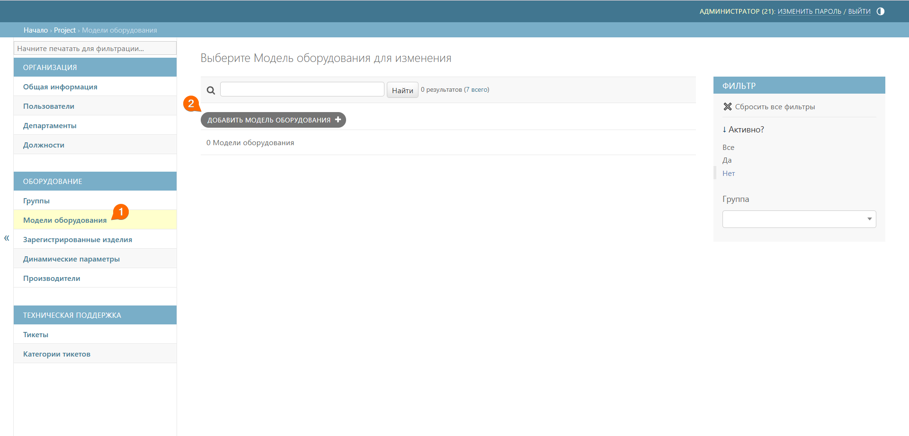



3. Заполните поля в окне создания модели 
4. Нажмите кнопку **Сохранить**



 Обязательные для заполнения поля при создании модели выделены полужирным шрифтом – без их заполнения сохранение модели невозможно.





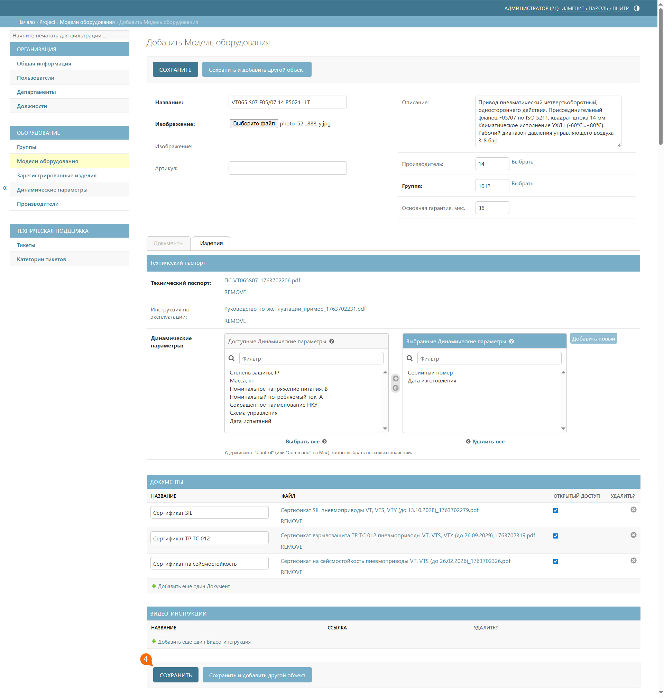



## Регистрация изделия
После создания модели можно приступать к регистрации изделия.

Для регистрации изделия выполните следующие шаги:
1. Перейдите к подразделу **Модели оборудования**
2. Нажмите на наименование нужной модели



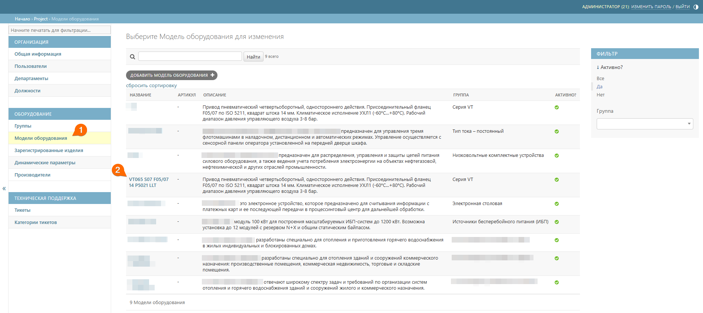



3. Перейдите к вкладке **Изделия**



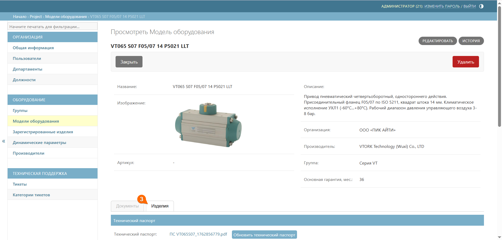





 После создания модели оборудования возможность регистрации изделий временно недоступна, так как администратору системы QR-Passport требуется связать динамические параметры с шаблоном паспорта. Обычно это занимает не более часа, поэтому рекомендуем создавать модели заранее – до момента, когда потребуется регистрировать изделия.



4. Нажмите кнопку **Зарегистрировать изделие** (для регистрации одного изделия) или кнопку **Массовая регистрация** (для регистрации нескольких изделий сразу). 

<!--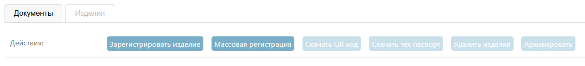-->

Подробнее про шаг 4 см. ниже:



- Кнопка «Зарегистрировать изделия»

    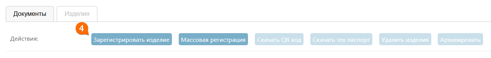

    5. Откроется окно регистрации изделия. Заполните значения динамических параметров
    6. Нажмите кнопку **Сохранить**

    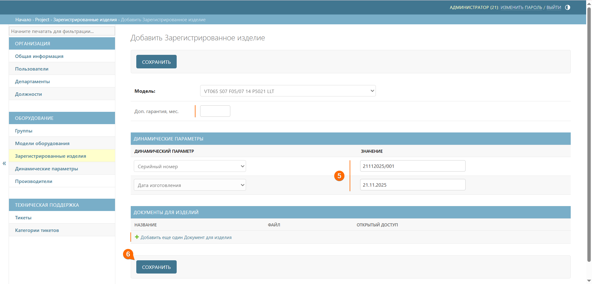

- Кнопка «Массовая регистрация»

    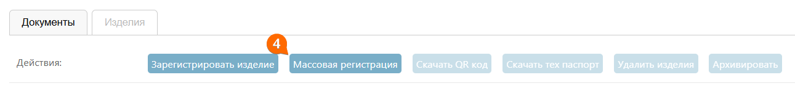
    
    5. Откроется окно регистрации изделий. Заполните значения динамических параметров, учитывая следующие особенности:
    * поле **Значение** – введите серийный номер, при этом заключите изменяемую часть серийного номера в фигурные скобки **{ }**. 
    
        Например, 12345{01}, где 1234501 – это серийный номер, а {01} – это его изменяемая часть. При генерации нескольких серийных номеров будет меняться только часть номера, которая заключена в фигурные скобки. 
        
            Результат будет выглядеть так: 1234501, 1234502, 1234503, 1234504 и т.д.

    * поле **Инкремент** – введите число, на которое будет увеличиваться изменяемая часть серийного номера, например: 
    
        При инкременте᠎ – 1 
        
            Результат будет выглядеть так: 1234501 → 1234502 → 1234503 и т.д. 
            
        При инкременте – 5
        
            Результат будет выглядеть так: 1234501 → 1234506 → 1234511 и т.д.

    * поле **Количество изделий** – введите общее количество одновременно регистрируемых изделий.
    6. Нажмите кнопку **Сохранить**

    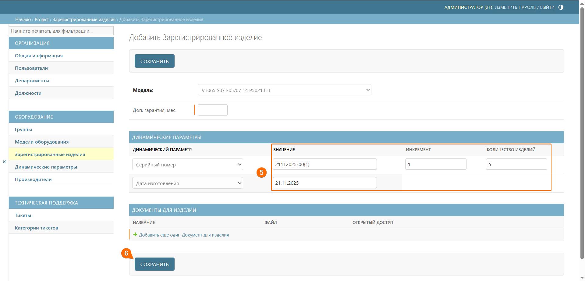

    7. Подтвердите или отредактируйте список получившихся серийных номеров и нажмите кнопку **Сохранить**

    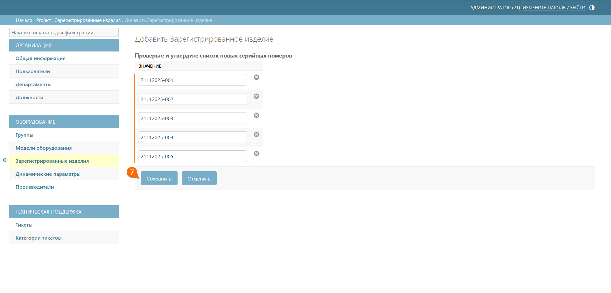





Созданные изделия попадают в список подраздела [зарегистрированные изделия](registered_products.md#anchor).



