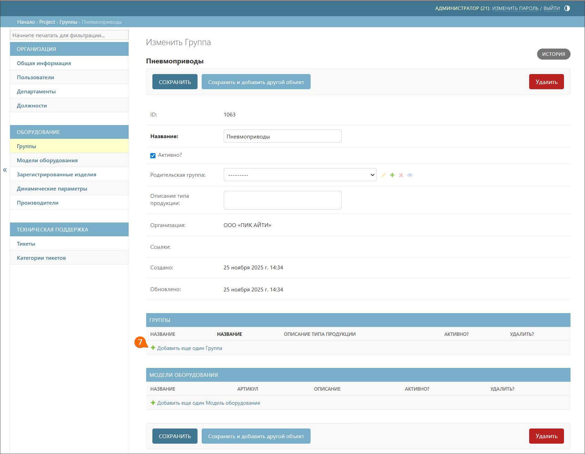
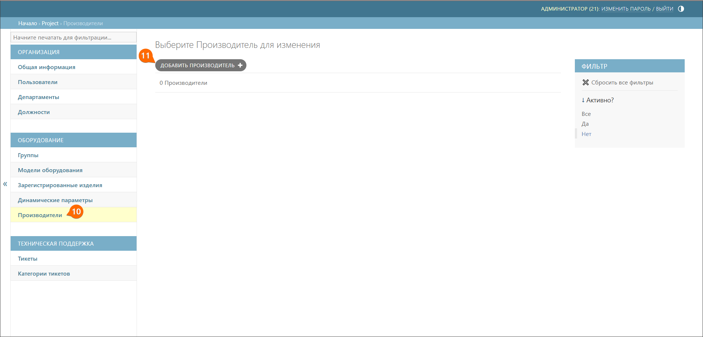
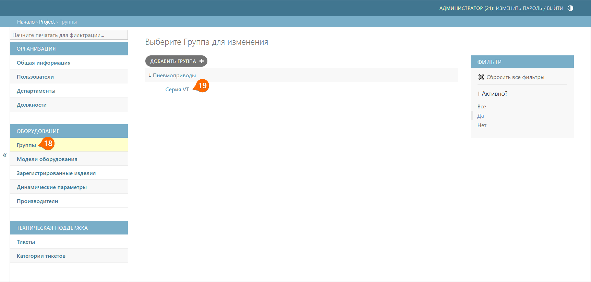
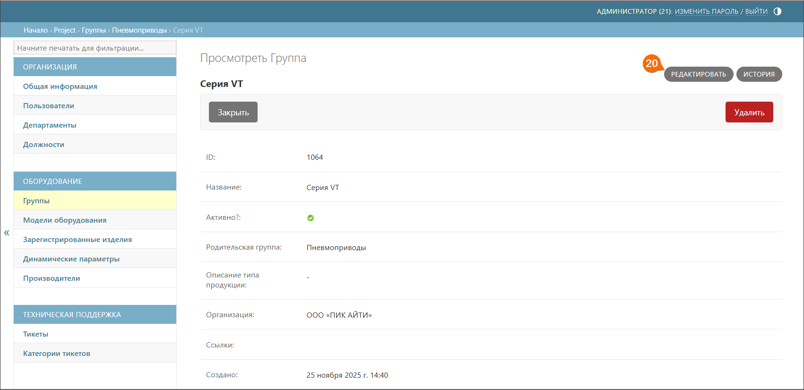
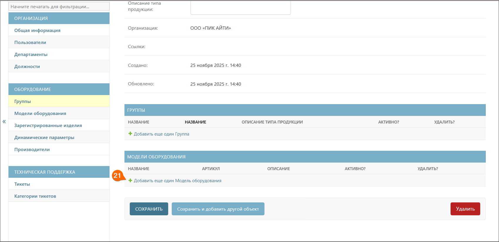
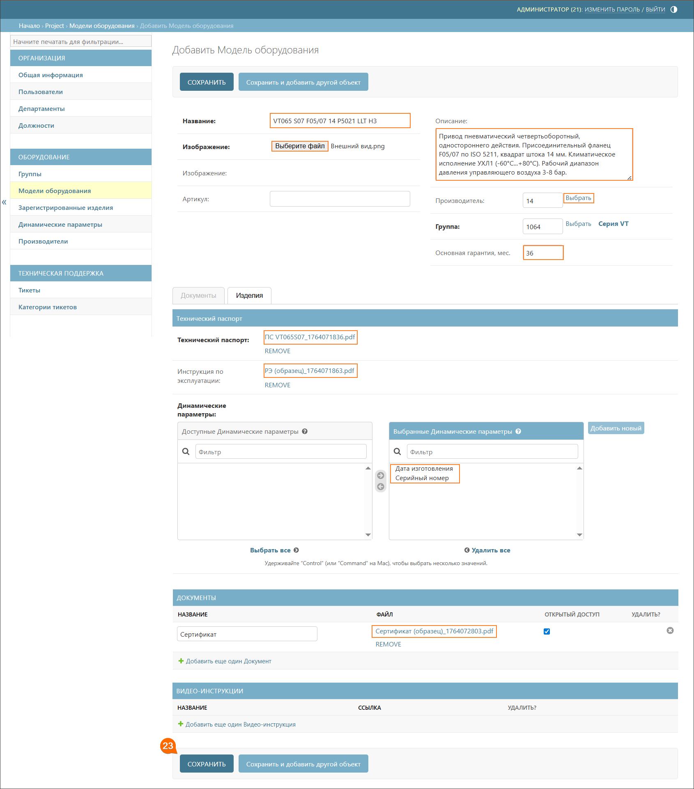
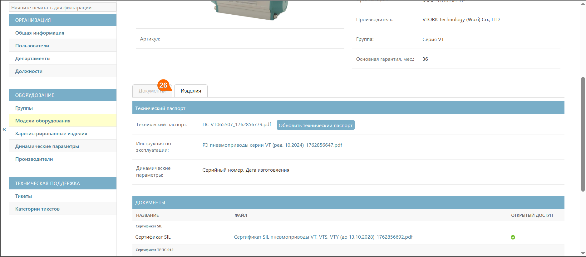
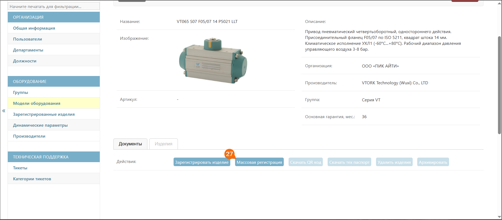
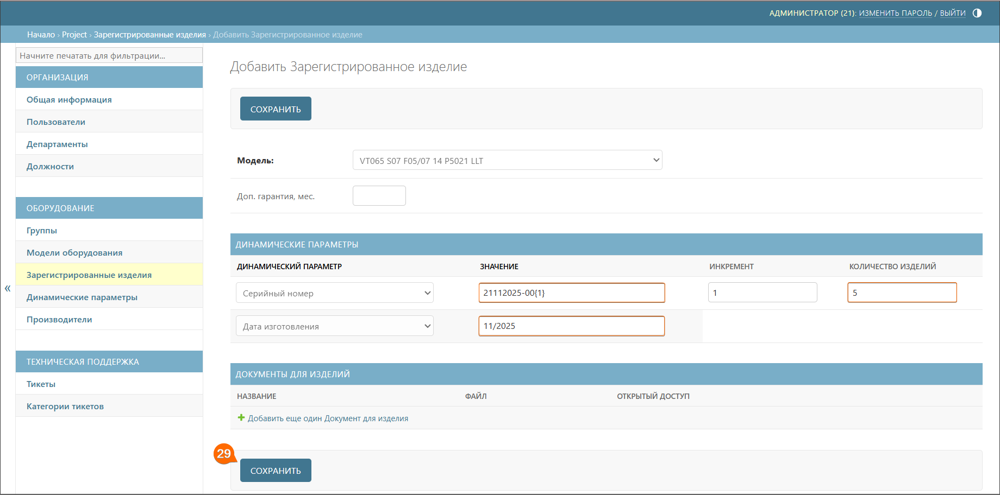

# Быстрый старт

Раздел содержит пошаговую инструкцию по освоению основного процесса работы в системе QR-Passport – создание моделей оборудования и регистрация изделий.

## Порядок работы
Инструкция разделена на этапы, выполнение которых позволяет последовательно освоить функционал системы. Каждый этап содержит четкие шаги и пояснения. Для начала работы рекомендуется ознакомиться с основными понятиями системы и перейти к тестовой модели.

## Основные понятия и процессы
* **Модель оборудования** –  типовая конфигурация, которая определяет общие характеристики для группы однотипных устройств. Содержит общие характеристики, документацию и динамические поля для всех относящихся к ней изделий.

* **Изделие** – конкретная единица продукции, созданная на основе определенной модели. Наследует общие характеристики модели, но имеет уникальные значения динамических параметров.

* **Динамические параметры** – настраиваемые характеристики, которые добавляются к модели и заполняются для каждого изделия отдельно. Позволяют учитывать индивидуальные особенности разных единиц оборудования.

* **Зарегистрировать изделие** – это процесс внесения в систему данных о конкретной единице продукции, который включает заполнение динамических параметров (серийный номер, дата изготовления и другие). Результат: изделие получает собственный QR-код и становится полноценным объектом учета в системе с возможностью отслеживания его характеристик, документации и получения технической поддержки.

## Активные элементы в инструкции
В инструкции используются активные элементы. Ниже приведены примеры таких элементов и пояснения, как с ними работать.



* **_Текст для копирования_** – чтобы не вводить текст вручную, используйте элементы голубого цвета. Например: «_Введите название группы `Пневмоприводы`_». Кликните на элемент `Пневмоприводы` и текст скопируется в буфер обмена (без визуального подтверждения), после чего вы можете вставить его в нужное поле.

* **_Ссылки для скачивания_** – в шаге 22 есть активные ссылки для скачивания файлов, выглядят они так: «_технический паспорт – загрузите файл. Для тестовой модели используйте этот [документ][3]_». Нажмите на ссылку [документ][3], чтобы скачать файл для тестовой модели.

* **_Дополнительные материалы_** – в конце каждого блока есть ссылки на подробное описание функций. Например: «_Подробнее о структуре оборудования см. [группы](equipment/equipment.md#anchor)_». Используйте эти ссылки, если хотите изучить тему глубже.

* **_Скриншоты шагов_** – после каждой группы действий есть раскрывающийся список со скриншотами шагов. Нажмите на «_см. шаги 1-4_», чтобы развернуть изображения.

    

    

    

    

    



## Тестовая модель
### Описание
1. Создать модель пневмопривода серии VT с наименованием _VT065 S07 F05/07 14 P5021 LLT НЗ_ в системе. Компания-изготовитель этих пневмоприводов – _VTORK Technology (Wuxi) Co., LTD_. 
2. Зарегистрировать 5 изделий с датой изготовления _11/2025_ и серийными номерами:
    * _21112025-001;_
    * _21112025-002;_
    * _21112025-003;_
    * _21112025-004;_
    * _21112025-005._
3. Скачать паспорта и QR-коды на эти изделия.

<!--### Роль в системе
Для данной задачи ваша роль в системе – _company administrator_ с полными правами доступа к системе, кроме доступа к разделу **Техническая поддержка**.-->

## Шаги выполнения
Для начала работы с QR-Passport войдите в систему по [ссылке][1]. 



Для входа в систему QR-Passport используйте учетные данные, направленные администратором QR-Passport после обработки заявки на сайте.



### Структура оборудования
В первую очередь необходимо создать структуру оборудования. Для этого выполните следующие шаги:

1. В открывшемся окне перейдите в подраздел **Группы**. 
2. Нажмите кнопку **Добавить группу**.
3. Введите название группы `Пневмоприводы` – так назовем нашу родительскую группу, т.к. это название нашего оборудования и его можно взять за основу структуры.
4. Нажмите кнопку **Сохранить**.





Чтобы конкретизировать, что наша модель относится не только к группе _пневмоприводы_, но и к подгруппе _серия VT_, необходимо создать внутри родительской группы – дочернюю. 

Для этого выполните следующие шаги:

5. Нажмите на наименование группы **Пневмоприводы**, откроется окно для редактирования.
6. Нажмите кнопку **Редактировать**.
7. В блоке **Группы** нажмите кнопку **Добавить еще одну группу**, всплывет поле для редактирования.
8. Введите наименование подгруппы `Серия VT`.
9. Нажмите кнопку **Сохранить**.







Подробнее о структуре оборудования см. [группы](equipment/equipment.md#anchor).



### Производители
Перед созданием модели необходимо добавить компанию-изготовителя этих пневмоприводов – VTORK Technology (Wuxi) Co., LTD. Для этого выполните следующие шаги:

10. Перейдите в подраздел **Производители**.
11. Нажмите кнопку **Добавить производителя**.
12. Введите наименование `VTORK Technology (Wuxi) Co., LTD`.
13. Нажмите кнопку **Сохранить**.







Подробнее о производителях см. [производители](equipment/manufacturers.md#anchor).



### Динамические параметры
Перед созданием модели необходимо добавить динамические параметры этих пневмоприводов – серийный номер, дата изготовления. Для этого выполните следующие шаги:

14. Перейдите в подраздел **Динамические параметры**.
15. Нажмите кнопку **Добавить динамический параметр**.
16. Введите наименование `Серийный номер`.
17. Нажмите кнопку **Сохранить** (для создания динамического параметра `Дата изготовления`, повторите шаги 14-17).







Подробнее о динамических параметрах см. [динамические параметры](equipment/dynamic_parameters.md#anchor).



### Модель оборудования
После создания структуры для нашей модели приступаем к созданию самой модели. Для этого выполните следующие шаги:

18. Перейдите в подраздел **Группы**.
19. Раскройте список, нажав значок «**→**» рядом с наименованием _Пневмоприводы_, и перейдите в подгруппу **Серия VT**. В этой подгруппе будет создана модель.
20. Нажмите кнопку **Редактировать**.
21. Нажмите кнопку **Добавить еще одну модель оборудования**, откроется окно создания модели.
22. Заполните поля этими данными:
    * _название_ – `VT065 S07 F05/07 14 P5021 LLT НЗ`;
    * _изображение_ – загрузите файл. Для тестовой модели используйте этот [файл][2];
    * _описание_ – добавьте описание `Привод пневматический четвертьоборотный, одностороннего действия. Присоединительный фланец F05/07 по ISO 5211, квадрат штока 14 мм. Климатическое исполнение УХЛ1 (-60°С...+80°С). Рабочий диапазон давления управляющего воздуха 3-8 бар.`;
    * _производитель_ – нажмите кнопку **Выбрать**, чтобы выбрать созданного производителя;
    * _группа_ – должна быть уже выбрана, т.к. мы перешли к созданию модели через подраздел **Группы**;
    * _основная гарантия_ – вводим количество месяцев основной гарантии – `36`;
    * _технический паспорт_ – загрузите файл. Для тестовой модели используйте этот [документ][3];
    * _инструкция по эксплуатации_ – загрузите файл. Для тестовой модели используйте этот [документ][4];
    * _динамические параметры_ – выберите созданные динамические параметры двойным щелчком мыши;
    * _документы_ – загрузите файл, нажав кнопку **Добавить еще один документ**. Для тестовой модели используйте этот [документ][5] и введите название документа – `Сертификат`.
23. Нажмите кнопку **Сохранить**.







Подробнее о создании моделей см. [модели оборудования](equipment/models.md#anchor).





 После создания модели оборудования возможность регистрации изделий временно недоступна, так как администратору системы QR-Passport требуется связать динамические параметры с шаблоном паспорта. Обычно это занимает не более часа.



### Регистрация изделий
После создания модели, переходим к регистрации изделия в системе QR-Passport. Для этого выполните следующие шаги:

24. Перейдите в подраздел **Модели оборудования**.
25. Нажмите на наименование модели **VT065 S07 F05/07 14 P5021 LLT НЗ**.
26. Перейдите к вкладке **Изделия**.
27. Нажмите кнопку **Массовая регистрация**.
28. Заполните поля этими данными:
    * _серийный номер_ – `21112025-00{1}`;
    * _дата изготовления_ – `11/2025`;
    * _инкремент_ – `1`;
    * _количество изделий_ – `5`.
29. Нажмите кнопку **Сохранить**.







Подробнее о регистрации изделий см. [регистрация изделий](equipment/models.md#anchor).



### Скачивание QR-кодов

30. Перейдите в подраздел **Зарегистрированные изделия**.
31. Галочками выберите серийные номера изделий (**21112025-001** – **21112025-005**).
32. В выпадающем списке выберите **Скачать QR-коды**.
33. Нажмите кнопку **Выполнить**.
34. Выберите формат этикетки – **Квадрат**.
35. Выберите размер этикетки – **30×30**.
36. Нажмите кнопку **Скачать QR-код**.







Подробнее о скачивании QR-кодов см. [скачивание QR-кода/QR-кодов](equipment/registered_products.md#anchor).





QR-коды тестовых моделей не предназначены для сканирования – используйте их только для ознакомления с функционалом системы. При сканировании тестового QR-кода система автоматически присваивает изделию статус действующего. После этого модель нельзя будет удалить. 



### Скачивание паспортов

37. Перейдите в подраздел **Зарегистрированные изделия**.
38. Галочками выберите серийные номера изделий (**21112025-001** – **21112025-005**).
39. В выпадающем списке выберите **Скачать технические паспорта**.
40. Нажмите кнопку **Выполнить**.







Подробнее о скачивании QR-кодов см. [скачивание паспорта/паспортов](equipment/registered_products.md#anchor).



## Результат

Основные возможности системы QR-Passport изучены. Для перехода к реальной эксплуатации системы необходимо выполнить следующие действия:

1. _Удаление тестовой модели_
   - Перейдите в подраздел **Модели оборудования**.
   - Выберите созданную модель **VT065 S07 F05/07 14 P5021 LLT НЗ**.
   - Нажмите кнопку **Удалить**.
   - Подтвердите удаление, нажав кнопку **Да, я уверен**.



После удаления модели все привязанные к ней изделия удаляются автоматически, а их QR-коды становятся неактивными.



2. _Дальнейшие действия_
    - Изучите остальные разделы инструкции.
    - Приступите к созданию рабочих моделей и регистрации оборудования для повседневной эксплуатации.

[1]: https://qrpassport.app/admin 
[2]: https://drive.google.com/file/d/1xh0eA0VrihKidtuXI3gAO0bzgLKrW8QQ/view?usp=drive_link
[3]: https://drive.google.com/file/d/1YYg4_5evp6vykjUT1olIjb18uZoRsn_g/view?usp=drive_link
[4]: https://drive.google.com/file/d/1mRRGFpbjrGEp9eqvCwIgDGdlGtZt26YH/view?usp=drive_link 
[5]: https://drive.google.com/file/d/1k1JICkHH7NllwAIMN5Knjx--m0q1d6O_/view?usp=drive_link

