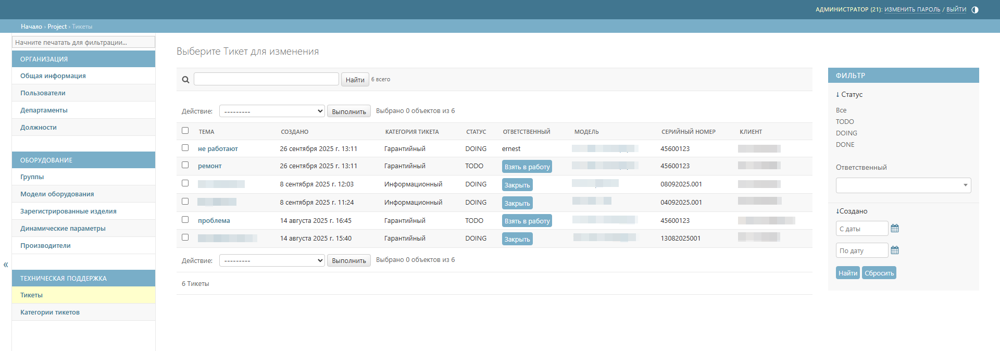
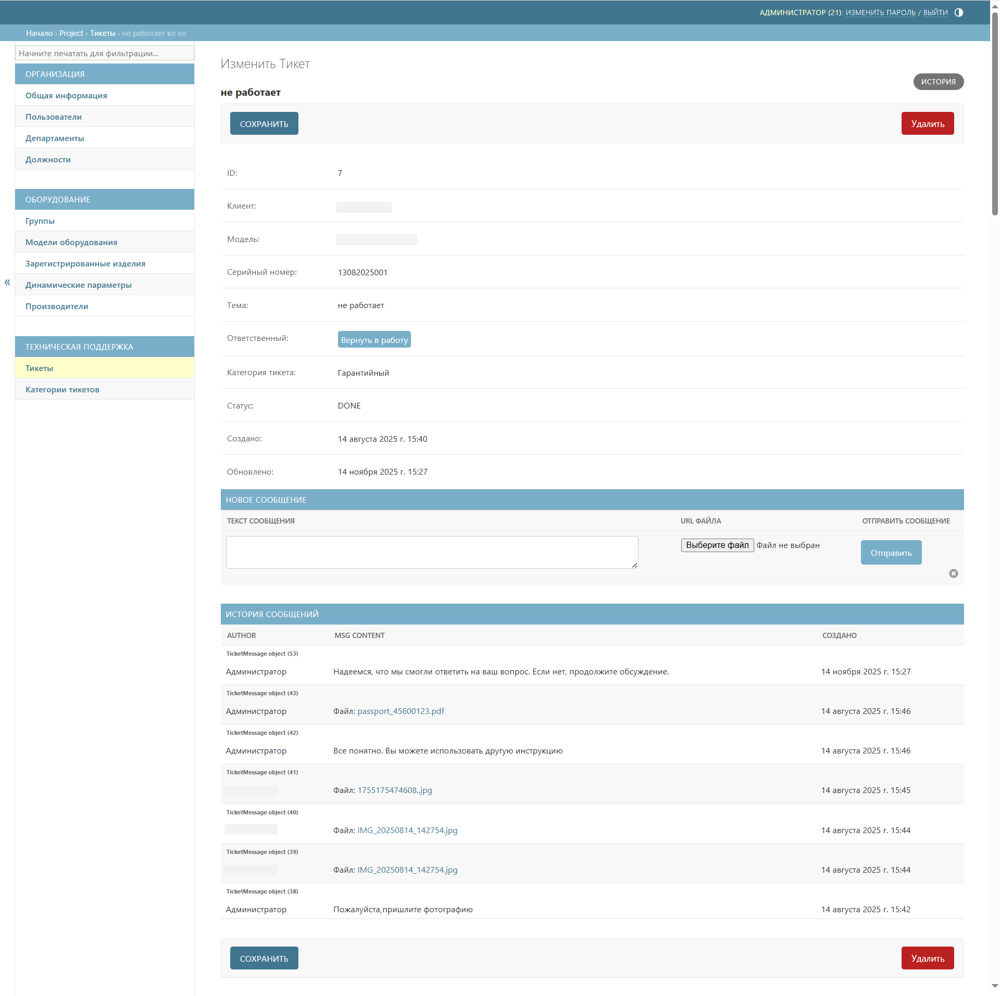

# Тикеты
Подраздел **Тикеты** содержит все обращения от пользователей. Позволяет отслеживать статусы заявок и просматривать всю историю сообщений.

## Описание главного окна

Таблица тикетов содержит следующие колонки:

* _тема_ – краткое описание проблемы (выше по наименованию этой колонки осуществляется поиск тикетов);
* _создано_ – дата и время создания обращения (справа доступна фильтрация тикетов по дате создания);
* _категория тикета_ – тип запроса;



Для удобства работы с тикетами сначала создайте [категории тикетов](ticket_categories.md#anchor).



* _статус_ – текущее состояние обработки тикета (справа доступна фильтрация по статусу: TODO, DOING, DONE или все);
* _ответственный_ – специалист, назначенный для работы с обращением (справа доступна фильтрация тикетов по ответственному);
* _модель_ – модель изделия, к которой относится обращение;
* _серийный номер_ – идентификатор изделия;
* _клиент_ – контактные данные отправителя обращения (электронная почта или номер телефона).

### Статусы тикета
* _TODO_ – новый тикет, ожидает назначения ответственного и начала работы;

* _DOING_ – тикет взят в работу, над обращением ведётся активная деятельность;



Если тикет взят в работу одним сотрудником, другие сотрудники не могут его закрыть.



* _DONE_ – тикет закрыт, вопрос решён.



Для возобновления работы по закрытому тикету необходимо нажать кнопку **Вернуть в работу**.



### Просмотр детальной информации
Для просмотра полной информации по конкретному обращению и работы с перепиской необходимо выбрать соответствующий тикет в общей таблице.

При нажатии на любой тикет в списке происходит переход на карточку тикета, где доступны:
- просмотр всех параметров обращения;
- изменение статуса тикета;
- вся история переписки с клиентом;
- отправка новых сообщений и файлов.

